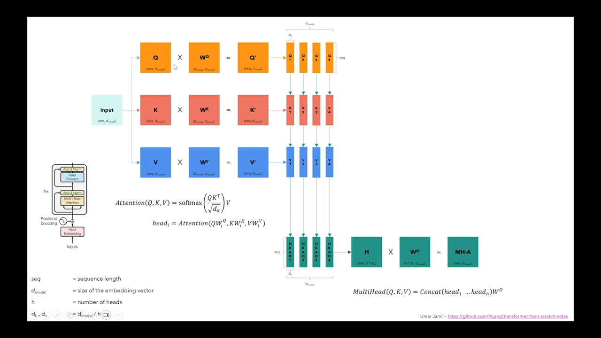

# Stable Diffusion

## Youtube: Coding Stable Diffusion from scratch in PyTorch

[source][1]

### What is a generative model?

A generative model learns a probability distribution of the data set such
that we can then sample from the distribution to create new instances of
data. For example, if we have many pictures of cats and we train a generative
model on it, we then sample from this distribution to create new images of
cats.

### Why do we model data as distributions?

- Imagine you're a criminial, and you want to generate thousands of fake
identities. Each fake identity, is made up of variables, representing the
characteristics of a person (age, height).
- You can ask the statistics department of the government to give you
statistics aboue the age and the height of the population and then sample
from these distributions.
- At first, you may sample from each distribution independently to create
a fake identity, but that would produce unreasonable pairs of (age, height).
- To generate fake identities that make sense, you need the joint distribution,
otherwise you may end up with an unreasonable pair of (age, height).
- We can also evaluate probabilities on one of the two variables using
conditional probability and / or by marginalizing a variable.

### Learning the distribution p(x) of our data

We have a reverse process (neural network) and forward process (fixed).

Given an original image X0 we add noise to the image and generate a new image
Z1. We continue to add noise and generate images until we arrive at Zt, the
last image which is pure noise.

- Remember that there is a forward process (creating a noise image) and there
is a backward process (creating an image from noise). To train the network for
the reverse process we need to train the network to detect how much noise is in
the nosified version of the image at time step t.

### How to generate new data?

TODO: (calvin) I have to fill this out

### CLIP (Contrastive Language-Image Pre-training)

### Architecture

### Lay Normalization

### Group Normalization

### Self Attention

Group normalization is layer normalization but with only a subset. You want group normalization
because the convulution filtering basically groups similar items together. The whole idea of
normalization is that we don't want the trainig to oscillate too much.

### TODO

- What is probability distribution
- What is joint distribution
- What is conditional probability
- What is marginalizing a variable?
  -  To marginalize a variable means to remove it from a set of variables by
  summing or integrating over that variable. This process is often used in
  statistics and probability theory to focus on the distributions of interest
  by eliminating the variables that are not of primary concern.
- What is multivariate gaussian
- What is classifier guidance
- What is classifier-free guidance

[1]: https://www.youtube.com/watch?v=ZBKpAp_6TGI